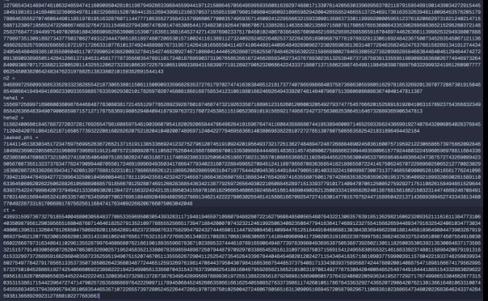

- [Crypto](#crypto)
- [Forensics](#forensics)
- [Web](#web)
- [Rev](#rev)
- [Pwn](#pwn)

## Crypto

### 0

Pada chall ini diberi 3 buah file, dua di antaranya merupakan pesan yang terenkripsi dan pesan yang sudah dekripsi dari pesan sebelumnya. Berdasarkan pattern-nya, pesan dapat didekripsi dengan membaca huruf dengan increment 2 kemudian jika sudah sampai paling kanan, baca huruf paling kanan yang belum dibaca lalu baca ke kiri dengan increment 2. Berikut solver yang digunakan

```c++
#include <bits/stdc++.h>
using namespace std;
#define int long long
signed main(){
    string s;
    cin >> s;
    int n = s.length();
    string ans = "";
    for(int i = 0; i < n; i += 2) ans += s[i];
    for(int i = n - 1 - (n & 1); i >= 0; i-=2)
    ans += s[i];
cout << ans << endl;
}
```

### Flag:

```
Meta4Sec{sajjjaddddkunnnn_absoluteeee_cineemaaaaaa_202cb962ac}
```

### BabyCry

> Kalau kamu paham bahasa francis, kamu bisa mendapatkan flagnya

Diberi file yang berisi teks sangat panjang, dengan mencari char ‘{‘ di teks saya dapat flag yang terenkripsi, yaitu “Olhc4Gpc{Cyua_Jkupnxvg_Lbefjpmmqu}”. Saya menebak Olhc4Gpc itu Meta4Sec (jelaslah ya). Tebakan pertama jelas vigenere.

Berdasarkan penggalan flag tersebut, didapat juga penggalan key “CHOCOLA”. Sisanya dapat diisi dengan tebakan kata yang cukup umum, yaitu “CHOCOLATE”.

### Flag:

```
Meta4Sec{Just_Vigenere_Encryption}
```

### Another RSA Challenge

> RSA di gitu gituin challenge

DIberi 2 file yaitu file skrip python dan outputnya, isinya kek gini:

```python
from Crypto.Util.number import *
from Crypto.Random import random
import os

BITS = 512
rand = random.randint(2,12)
primes = [getPrime(BITS) for _ in range(rand)]
e1 = 0x10001
n1 = phi = 1
for i in range(rand):
 n1 *= primes[i]
 phi *= primes[i]-1

p,q = getPrime(BITS), getPrime(BITS)
n2 = p*q
e2 = 3
phi2 = (p-1)*(q-1)
d2 = inverse(e2,phi2)

FLAG = b"Meta4Sec{REDACTED}"
while len(FLAG)*8 + 128 < (n1*n2).bit_length() :
 FLAG += os.urandom(16)
c = pow(bytes_to_long(FLAG), e1, n1*n2)

print("n1 = ", n1)
print("n2 = ", n2)
print("hehe1 = ", pow(d2,e2,n2))
print("hehe2 = ", pow(phi2,e2,n2))
print("leaked_phi = ", phi&((1<<(BITS*(rand-1)))-1))
print("ct = ", c)
```



Pertama, kita lihat dulu skrip generatornya. Intinya, skrip ini melakukan beberapa
hal:

1. Bikin sebuah modulus n1 yang merupakan hasil perkalian dari rand (antara
   2-12) bilangan prima 512-bit.
2. Bikin modulus RSA biasa, n2 = p\*q.
3. Flag-nya dienkripsi pake e1 = 0x10001 dengan modulus gabungan N = n1 - n2.

4. Kita dikasih beberapa leak atau bocoran: n1, n2, leaked_phi (beberapa bit
   terakhir dari phi(n1)), ct (ciphertext), dan dua nilai aneh hehe1 & hehe2.
   Untuk dekripsi, kita butuh private key d1, yang artinya kita butuh phi(N). Karena
   n1 dan n2 koprima, maka phi(N) = phi(n1) \* phi(n2). Jadi, misi kita dibagi
   dua: cari phi(n1) dan cari phi(n2).
   Langkah 1: Membongkar n2
   Ini bagian yang bikin kita muter-muter. Leak yang kita punya untuk n2 adalah:
   • hehe1 = d2^3 mod n2
   • hehe2 = phi2^3 mod n2

   Hubungan antara d2 dan phi2 adalah 3 _ d2 = k _ phi2 + 1 untuk suatu
   integer k. Karena d2 < phi2, nilai k ini pasti kecil, kemungkinannya cuma 1 atau

5. Kita bisa bikin dua polinomial yang punya akar yang sama, yaitu X = p+q-1.
6. Dari hehe2: kita tahu phi2^3 ≡ hehe2 (mod n2). Karena phi2 = n2 -
   X, ini bisa disederhanakan jadi X^3 + hehe2 ≡ 0 (mod n2). Jadilah
   polinomial pertama: P1(x) = x^3 + hehe2.
7. Dari hehe1: kita tahu d2^3 ≡ hehe1 (mod n2). Setelah dijabarkan, ini
   bisa jadi polinomial kedua dalam X: P2(x) = (-2x+1)^3 - 27*hehe1.
   (Kita pakai k=2 karena secara matematis ini yang paling valid).
   Kita bisa pakai metode GCD Polinomial buat nemuin akarnya. Dengan sedikit
   manipulasi aljabar (mengeliminasi suku pangkat tertinggi), kita bisa dapet
   persamaan linear buat X. Dari situ, nilai X langsung ketemu.
   Setelah X dapet, kita bisa:
   • Hitung s = X+1.
   • Faktorkan n2 dengan mencari akar dari y^2 - s*y + n2 = 0.
   • Dapet p dan q, lalu hitung phi2 = (p-1)\*(q-1).
   Langkah 2: Mencari phi(n1)
   Kita punya leaked_phi, yaitu bit-bit terakhir dari phi(n1). Bit-bit awalnya hilang.
8. Cari rand: rand ini jumlah bilangan prima yang menyusun n1. Cara paling
   bener buat nebaknya adalah rand = round(n1.bit_length() / 512).
   Di kasus kita (setelah dapet data yang bener), rand jadi 11.
9. Tebak Bit yang Hilang: Kita bisa aproksimasi nilai phi(n1) itu deket banget
   sama n1. Selisihnya, n1 - phi(n1), kira-kira sebesar rand dikali
   2^(BITS\*(rand-1)). Dari sini, kita bisa tebak bit-bit awal phi(n1) yang
   hilang dengan rumus phi_H ≈ n1_H - rand.
10. Brute-force: Karena ini cuma tebakan, kita tinggal looping di sekitar nilai
    tebakan itu. Kita coba beberapa nilai i di range(-250, 250), gabungkan
    dengan leaked_phi, dan coba dekripsi. Salah satunya pasti bener
    Langkah 3: Dekripsi Final
    Setelah phi1 (dari langkah 2) dan phi2 (dari langkah 1) ketemu

Hitung totient total: PHI_total = phi1 \* phi2.
Hitung private key: d1 = inverse(e1, PHI_total).
Dekripsi ciphertext: m = pow(ct, d1, n1 \* n2).
Ubah m jadi bytes: flag_bytes = long_to_bytes(m).

Berikut untuk skrip solper nya
